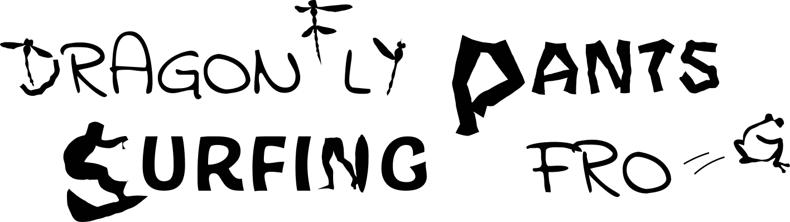
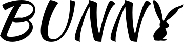
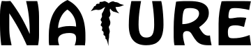

# Word-As-Image for Semantic Typography (SIGGRAPH 2023 - Honorable Mention Award)


[](https://arxiv.org/abs/2303.01818)
[](https://wordasimage.github.io/Word-As-Image-Page/) 
[](https://huggingface.co/spaces/SemanticTypography/Word-As-Image)
[](https://www.youtube.com/watch?v=9D12a6RCQaw)

<br>
<div align="center">
    
</div>
<br><br>
A few examples of our <b>W</b>ord-<b>A</b>s-<b>I</b>mage illustrations in various fonts and for different textual concept. The semantically adjusted letters are created
completely automatically using our method, and can then be used for further creative design as we illustrate here.<br><br>

> Shir Iluz*, Yael Vinker*, Amir Hertz, Daniel Berio, Daniel Cohen-Or, Ariel Shamir    
> \* Denotes equal contribution  
>
>A word-as-image is a semantic typography technique where a word illustration
presents a visualization of the meaning of the word, while also
preserving its readability. We present a method to create word-as-image
illustrations automatically. This task is highly challenging as it requires
semantic understanding of the word and a creative idea of where and how to
depict these semantics in a visually pleasing and legible manner. We rely on
the remarkable ability of recent large pretrained language-vision models to
distill textual concepts visually. We target simple, concise, black-and-white
designs that convey the semantics clearly.We deliberately do not change the
color or texture of the letters and do not use embellishments. Our method
optimizes the outline of each letter to convey the desired concept, guided by
a pretrained Stable Diffusion model. We incorporate additional loss terms
to ensure the legibility of the text and the preservation of the style of the
font. We show high quality and engaging results on numerous examples
and compare to alternative techniques.


## Description
Official implementation of Word-As-Image for Semantic Typography paper.
<br>

## Setup

1. Clone the repo:
```bash
git clone https://github.com/WordAsImage/Word-As-Image.git
cd Word-As-Image
```
2. Create a new conda environment and install the libraries:
```bash
conda create --name word python=3.8.15
conda activate word
pip install torch==1.12.1+cu113 torchvision==0.13.1+cu113 --extra-index-url https://download.pytorch.org/whl/cu113
conda install -y numpy scikit-image
conda install -y -c anaconda cmake
conda install -y -c conda-forge ffmpeg
pip install svgwrite svgpathtools cssutils numba torch-tools scikit-fmm easydict visdom freetype-py shapely
pip install opencv-python==4.5.4.60  
pip install kornia==0.6.8
pip install wandb
pip install shapely
```

3. Install diffusers:
```bash
pip install diffusers==0.8
pip install transformers scipy ftfy accelerate
```
4. Install diffvg:
```bash
git clone https://github.com/BachiLi/diffvg.git
cd diffvg
git submodule update --init --recursive
python setup.py install
```

5. Paste your HuggingFace [access token](https://huggingface.co/settings/tokens) for StableDiffusion in the TOKEN file.
## Run Experiments 
```bash
conda activate word
cd Word-As-Image

# Please modify the parameters accordingly in the file and run:
bash run_word_as_image.sh

# Or run :
python code/main.py --experiment <experiment> --semantic_concept <concept> --optimized_letter <letter> --seed <seed> --font <font_name> --use_wandb <0/1> --wandb_user <user name> 
```
* ```--semantic_concept``` : the semantic concept to insert
* ```--optimized_letter``` : one letter in the word to optimize
* ```--font``` : font name, the <font name>.ttf file should be located in code/data/fonts/

Optional arguments:
* ```--word``` : The text to work on, default: the semantic concept
* ```--config``` : Path to config file, default: code/config/base.yaml
* ```--experiment``` : You can specify any experiment in the config file, default: conformal_0.5_dist_pixel_100_kernel201
* ```--log_dir``` : Default: output folder
* ```--prompt_suffix``` : Default: "minimal flat 2d vector. lineal color. trending on artstation"

### Examples
```bash
python code/main.py  --semantic_concept "BUNNY" --optimized_letter "Y" --font "KaushanScript-Regular" --seed 0
```
<br>
<div align="center">
    
</div>


```bash
python code/main.py  --semantic_concept "LEAVES" --word "NATURE" --optimized_letter "T" --font "HobeauxRococeaux-Sherman" --seed 0
```
<br>
<div align="center">
    
</div>

* Pay attention, as the arguments are case-sensitive, but it can handle both upper and lowercase letters depending on the input letters.


## Tips
If the outcome does not meet your quality expectations, you could try the following options:

1. Adjusting the weight 𝛼 of the L𝑎𝑐𝑎𝑝 loss, which preserves the letter's structure after deformation.
2. Modifying the 𝜎 parameter of the low-pass filter used in the L𝑡𝑜𝑛𝑒 loss, which limits the degree of deviation from the original letter.
3. Changing the number of control points, as this can influence the outputs.
4. Experimenting with different seeds, as each may produce slightly different results.
5. Changing the font type, as this can also result in various outputs.


## Acknowledgement
Our implementation is based ob Stable Diffusion text-to-image model from Hugging Face's [Diffusers](https://github.com/huggingface/diffusers) library, combined with [Diffvg](https://github.com/BachiLi/diffvg). The framework is built on [Live](https://github.com/Picsart-AI-Research/LIVE-Layerwise-Image-Vectorization).
    
## Citation
If you use this code for your research, please cite the following work: 
```
@article{IluzVinker2023,
    author = {Iluz, Shir and Vinker, Yael and Hertz, Amir and Berio, Daniel and Cohen-Or, Daniel and Shamir, Ariel},
    title = {Word-As-Image for Semantic Typography},
    year = {2023},
    issue_date = {August 2023},
    publisher = {Association for Computing Machinery},
    address = {New York, NY, USA},
    volume = {42},
    number = {4},
    issn = {0730-0301},
    url = {https://doi.org/10.1145/3592123},
    doi = {10.1145/3592123},
    journal = {ACM Trans. Graph.},
    month = {jul},
    articleno = {151},
    numpages = {11},
    keywords = {semantic typography, SVG, stable diffusion, fonts}
}
```
    
## Licence
This work is licensed under a [Creative Commons Attribution-NonCommercial-ShareAlike 4.0 International License](http://creativecommons.org/licenses/by-nc-sa/4.0/).
